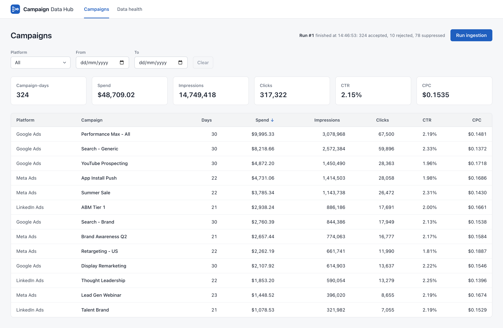
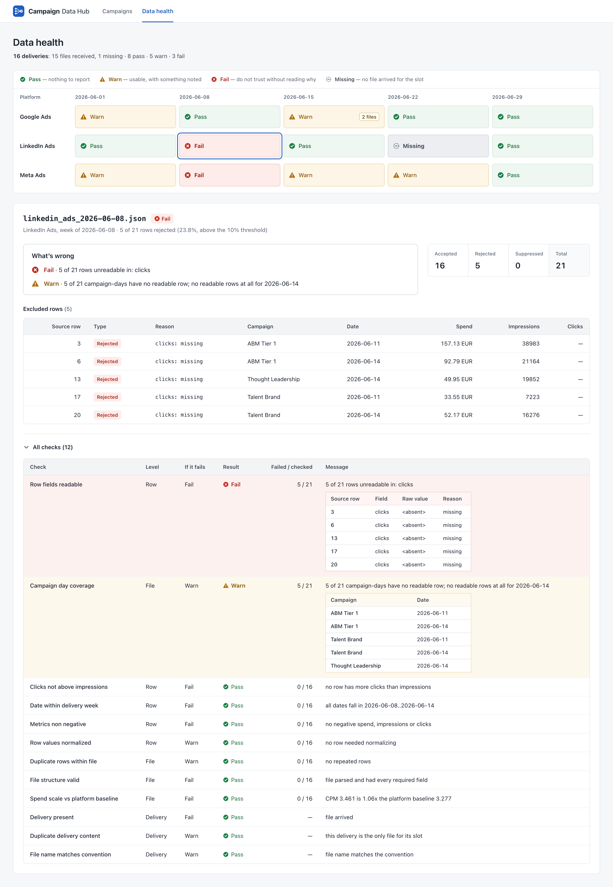
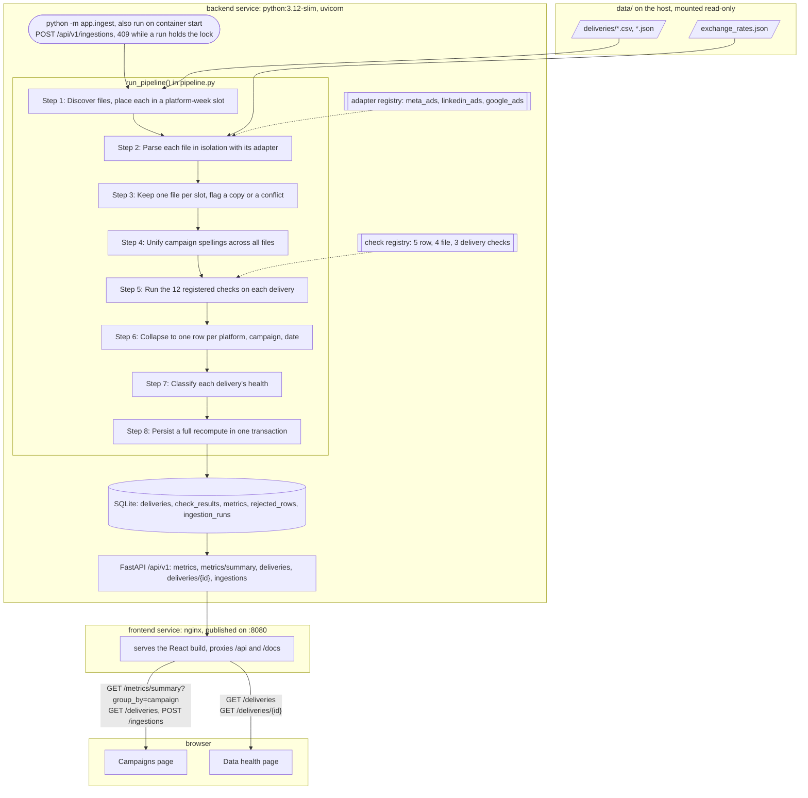

# Campaign Data Hub

Ingests weekly Meta, Google and LinkedIn deliveries into one daily USD dataset and grades every delivery's quality.\
Python 3.12, FastAPI, SQLAlchemy and SQLite; React, TypeScript and Vite; nginx and Docker Compose.\
Run `docker compose up --build`, then open http://localhost:8080.

### Campaigns

Spend, impressions, clicks, CTR and CPC per campaign, with filters, totals and sortable columns.



### Data health

Every delivery's pass, warn or fail status by platform and week, with the checks behind one delivery.



## Quick start with Docker

Needs Docker with Compose v2 and a free port 8080. From the repository root:

```bash
docker compose up --build
```

Open http://localhost:8080. The backend ingests `data/` before it starts serving, so the first page already has data:

| Page | What you should see |
|---|---|
| Campaigns | 324 campaign-days, $48,709.02 spend, 13 campaigns |
| Data health | 16 deliveries: 8 pass, 5 warn, 3 fail |

| To | Run |
|---|---|
| Run the tests in the container | `docker compose exec backend pytest` |
| Reset the database | `docker compose down && docker compose up` |
| Read the API docs | open http://localhost:8080/docs |

The database lives inside the backend container, so `down` deletes it and the next `up` rebuilds it from `data/`. Run ingestion on the Campaigns page re-runs the pipeline; the numbers do not change.

## Manual setup

Needs Python 3.12 and Node 18, 20 or 22+ (Vite 6). I used Python 3.12.0 and Node 25. Backend, from the repository root:

```bash
python3.12 -m venv .venv
source .venv/bin/activate
pip install -r backend/requirements.txt
cd backend
python -m app.ingest               # run ingestion from the CLI; prints a table per delivery and per platform
uvicorn app.api.app:app --reload   # API on http://127.0.0.1:8000, docs at /docs
```

Frontend, in a second terminal from the repository root:

```bash
cd frontend
npm ci
npm run dev                        # http://localhost:5173, proxies /api to port 8000
```

Tests, from `backend/` with the virtualenv active: `pytest` (six tests, about a second).

The CLI and the API share one SQLite file at the repository root; stop the API and run `rm campaign_data_hub.db*` to start empty. `CDH_DATA_DIR` and `CDH_DATABASE_URL` override the data folder and the database, which is how Docker points them at `/data` and `/db`.

## Architecture



The same diagram as an image: [docs/architecture.png](docs/architecture.png). One row from file to screen, `meta_ads_2026-06-01.csv` line 2, `Summer Sale,06/01/2026,200.08,37215,574`:

1. Discovery places the file in the (meta_ads, week of 2026-06-01) slot, and the adapter registry hands it to `MetaAdsAdapter`.
2. The adapter reads `06/01/2026` with `%m/%d/%Y` and converts `200.08` USD at rate 1.0 to 200,080,000 micro-USD, keeping source row 2.
3. "Summer Sale" is already the campaign's most common spelling. The row passes every row check, and its file's CPM is within 10x of Meta's other weeks, so it is kept.
4. It is written to `metrics` under the key (meta_ads, Summer Sale, 2026-06-01) with its lineage, in the same transaction as the quality report.
5. `GET /api/v1/metrics/summary?group_by=campaign` adds it to Summer Sale's 21 other days and rounds once: $3,785.34.
6. The Campaigns page shows that figure in the Meta Ads, Summer Sale row.

## Project structure

```
.
├── backend/                            - Python backend
│   ├── app/                            - the backend code
│   │   ├── adapters/                   - one reader per platform
│   │   │   ├── __init__.py             - list of platforms
│   │   │   ├── base.py                 - shared row format
│   │   │   ├── google_ads.py           - reads Google Ads CSV
│   │   │   ├── linkedin_ads.py         - reads LinkedIn Ads JSON
│   │   │   └── meta_ads.py             - reads Meta Ads CSV
│   │   ├── api/                        - the REST API
│   │   │   ├── app.py                  - creates the FastAPI app
│   │   │   ├── deliveries.py           - delivery health endpoints
│   │   │   ├── deps.py                 - database session per request
│   │   │   ├── errors.py               - one error format
│   │   │   ├── ingestions.py           - runs ingestion on request
│   │   │   ├── metrics.py              - campaign metrics endpoints
│   │   │   └── schemas.py              - API response shapes
│   │   ├── checks/                     - the 12 quality checks
│   │   │   ├── base.py                 - check inputs and outputs
│   │   │   ├── delivery.py             - checks on whole deliveries
│   │   │   ├── file.py                 - checks on whole files
│   │   │   ├── registry.py             - list of all checks
│   │   │   └── row.py                  - checks on single rows
│   │   ├── config.py                   - paths, weeks, thresholds
│   │   ├── db.py                       - database connection
│   │   ├── discovery.py                - matches files to weeks
│   │   ├── health.py                   - decides pass, warn or fail
│   │   ├── ingest.py                   - command-line ingestion
│   │   ├── models.py                   - database tables
│   │   ├── money.py                    - currency conversion
│   │   ├── normalize.py                - merges campaign spellings
│   │   └── pipeline.py                 - runs ingestion end to end
│   ├── tests/                          - automated tests
│   │   └── test_pipeline.py            - the six tests
│   ├── Dockerfile                      - backend container image
│   ├── pytest.ini                      - test settings
│   └── requirements.txt                - Python dependencies
├── data/                               - input data
│   ├── deliveries/                     - the 15 delivery files
│   └── exchange_rates.json             - currency rates to USD
├── docs/                               - documentation images
│   ├── screenshots/                    - screenshots of both pages
│   └── architecture.png                - architecture diagram
├── frontend/                           - React app
│   ├── public/                         - favicon
│   ├── src/                            - the app code
│   │   ├── api/                        - talks to the backend
│   │   │   ├── client.ts               - sends API requests
│   │   │   ├── types.ts                - API response types
│   │   │   └── useApi.ts               - loads data for a page
│   │   ├── components/                 - parts of the pages
│   │   │   ├── CampaignTable.tsx       - sortable campaign table
│   │   │   ├── DeliveryDetail.tsx      - one delivery's checks
│   │   │   ├── Filters.tsx             - platform and date filters
│   │   │   ├── HealthGrid.tsx          - status of every delivery
│   │   │   ├── icons.tsx               - status icons
│   │   │   ├── Legend.tsx              - explains the status colours
│   │   │   ├── RunIngestionButton.tsx  - the Run ingestion button
│   │   │   └── TotalsBar.tsx           - totals above the table
│   │   ├── lib/                        - helper functions
│   │   │   ├── excluded.ts             - reads excluded rows
│   │   │   ├── format.ts               - formats numbers and money
│   │   │   ├── labels.ts               - display names
│   │   │   └── slots.ts                - groups deliveries by week
│   │   ├── pages/                      - the two pages
│   │   │   ├── CampaignsPage.tsx       - Campaigns page
│   │   │   └── HealthPage.tsx          - Data health page
│   │   ├── App.tsx                     - header and page routes
│   │   ├── main.tsx                    - app entry point
│   │   ├── styles.css                  - styles
│   │   └── tokens.css                  - colours, sizes and fonts
│   ├── Dockerfile                      - builds and serves the app
│   ├── index.html                      - HTML page
│   ├── nginx.conf                      - web server and API proxy
│   ├── package-lock.json               - exact dependency versions
│   ├── package.json                    - dependencies and scripts
│   ├── tsconfig.json                   - TypeScript settings
│   └── vite.config.ts                  - dev server settings
├── ASSIGNMENT.md                       - the assignment brief
├── docker-compose.yml                  - runs backend and frontend
└── README.md                           - this file
```

How the parts connect:
- CLI: `python -m app.ingest` runs `ingest.main()`, which calls `pipeline.run_pipeline(session)`.
- API: `POST /api/v1/ingestions` runs `api/ingestions.start_ingestion()`, which takes the lock and calls the same `run_pipeline`.
- `run_pipeline` calls `discovery.discover()`, each adapter's `parse()`, `normalize.canonical_names()`, `checks/registry.run_check()` for every check in `ALL_CHECKS`, `collapse_to_key()`, `health.classify()`, then `persist()`, which replaces four tables, appends to `ingestion_runs` and commits once.
- `api/metrics.py` and `api/deliveries.py` read SQLite through SQLAlchemy; metrics round money once, with `money.micros_to_usd`.
- In the browser, `src/api/client.ts` calls `/api/v1`, `src/api/useApi.ts` holds each request's state, and `src/pages/` renders the two pages.

## Results on the provided data

From a fresh ingestion, `GET /api/v1/metrics/summary?group_by=platform` (the API returns CTR as a fraction; I show it as a percentage):

| Platform | Rows | Spend (USD) | Impressions | Clicks | CTR | CPC (USD) |
|---|---:|---:|---:|---:|---:|---:|
| Google Ads | 150 | 27,954.50 | 8,561,131 | 187,345 | 2.19% | 0.1492 |
| LinkedIn Ads | 64 | 5,869.97 | 1,798,222 | 38,025 | 2.11% | 0.1544 |
| Meta Ads | 110 | 14,884.55 | 4,390,065 | 91,952 | 2.09% | 0.1619 |
| **Total** | **324** | **48,709.02** | **14,749,418** | **317,322** | **2.15%** | **0.1535** |

Health of the 16 delivery records, 15 files plus one empty slot:

| Health | Count | Deliveries |
|---|---:|---|
| PASS | 8 | Google 06-08, 06-15, 06-22, 06-29; LinkedIn 06-01, 06-15, 06-29; Meta 06-29 |
| WARN | 5 | Google 06-01, Google 06-15 resend, Meta 06-01, 06-15, 06-22 |
| FAIL | 3 | LinkedIn 06-08, LinkedIn 06-22 (missing), Meta 06-08 (quarantined) |

The one judgment call that changes the total is `meta_ads_2026-06-08.csv`, whose spend is a factor of 100 too large:

| Option | Meta 06-08 adds | Total spend |
|---|---:|---:|
| Quarantine it (what I chose) | $0.00 | $48,709.02 |
| Divide its spend by 100 and ingest it | $4,800.70 | $53,509.72 |
| Ingest it as delivered | $480,070.00 | $528,779.02 |

## Data findings

Every defect the pipeline reported, from `GET /api/v1/deliveries/{id}`. Rows are CSV line numbers (the header is line 1) or LinkedIn array indices.

| File | Level | What is wrong | Caught by | Handling | Effect on the numbers |
|---|---|---|---|---|---|
| `meta_ads_2026-06-01.csv` | row | line 23 has the date `06/31/2026`, which does not exist | `row_fields_readable` | rejected | -1 row, -$241.02 |
| `meta_ads_2026-06-01.csv` | row | lines 12, 20, 29 have the campaign in lower case | `row_values_normalized` | renamed to the common spelling, kept | none |
| `meta_ads_2026-06-01.csv` | row | line 9 has an ISO date in a MM/DD/YYYY file | `row_values_normalized` | read with the fallback format, kept | none |
| `meta_ads_2026-06-15.csv` | row | lines 11, 12, 17 have an empty `clicks` | `row_fields_readable` | rejected | -3 rows, -$351.14 |
| `meta_ads_2026-06-15.csv` | row | lines 13, 15, 30 have trailing spaces in the campaign | `row_values_normalized` | trimmed, kept | none |
| `meta_ads_2026-06-22.csv` | row | line 8 has spend `-111.41` | `metrics_non_negative` | rejected | -1 row, +$111.41 since the row was negative |
| `linkedin_ads_2026-06-08.json` | row | indices 3, 6, 13, 17, 20 have no `clicks` | `row_fields_readable` | rejected; 23.8% of the file, so it FAILs | -5 rows, -$416.44, no LinkedIn data for 06-14 |
| `google_ads_2026-06-01.csv` | file | 8 repeated rows: 43 rows, 35 distinct | `duplicate_rows_within_file` | first copy kept | -8 rows, $1,299.61 not double counted |
| `meta_ads_2026-06-08.csv` | file | CPM 101.5x Meta's other weeks: spend a factor of 100 out | `spend_scale_vs_platform_baseline` | quarantined | -35 rows, see the table above |
| `linkedin_ads_2026-06-22.json` | delivery | no file arrived | `delivery_present` | empty slot recorded as FAIL | 7 days of LinkedIn data absent |
| `google_ads_2026-06-15_resend.csv` | delivery | byte-identical copy of 06-15 with `_resend` appended to the name | `duplicate_delivery_content`, `file_name_matches_convention` | counted once | -35 rows, $6,442.69 not double counted |

`campaign_day_coverage` also warns on the three files with rejected rows, naming the campaign-days each one lost.

## Normalization rules

| | Google Ads | Meta Ads | LinkedIn Ads |
|---|---|---|---|
| File format | CSV | CSV | JSON array of objects |
| Date | `Day`, `%Y-%m-%d` | `date`, `%m/%d/%Y`, then `%Y-%m-%d` (flagged) | `date_ts`, epoch milliseconds |
| Spend unit | `Cost (micros)`, divided by 1,000,000 | `spend_usd`, dollars | `spend.amount`, major units |
| Currency | `Currency` column, must be in the rates file | no column; USD assumed from the column name | `spend.currency`, must be in the rates file |
| Campaign | `Campaign` | `campaign_name` | `campaign` |
| Impressions, clicks | `Impr.`, `Clicks` | `impressions`, `clicks` | `impressions`, `clicks` |
| Source row | CSV line | CSV line | array index from 0 |
| Campaign spelling | trimmed, case unified across files | trimmed, case unified across files | trimmed, case unified across files |

- Each amount is a `Decimal` times its rate from `exchange_rates.json` (EUR is 1.08), stored as integer micro-USD.
- Totals stay in micros and are rounded once, to cents and half-up, when the API answers; CTR and CPC are ratios of sums.
- LinkedIn timestamps are read with `tz=timezone.utc`, so the host's timezone cannot move a date.

## Quality checks

Twelve checks, registered in `backend/app/checks/registry.py`; each one skips a delivery it has nothing to say about. A check that raises is recorded with status `error`, and the run continues.

| Check | Level | On failure | What it catches |
|---|---|---|---|
| `row_fields_readable` | row | fail, rejects the row | a missing or unreadable value, an impossible date, a date format the platform does not use, a currency missing from the rates |
| `date_within_delivery_week` | row | fail, rejects the row | a date outside the file's week, which is how a misread date format or epoch unit shows up |
| `row_values_normalized` | row | warn, flags | a campaign name trimmed or recased, a date read with the fallback format |
| `metrics_non_negative` | row | fail, rejects the row | negative spend, impressions or clicks |
| `clicks_not_above_impressions` | row | fail, rejects the row | more clicks than impressions |
| `file_structure_valid` | file | fail, quarantines the file | an unreadable file, missing columns, a name with no known platform or week, a second file that disagrees with its slot |
| `duplicate_rows_within_file` | file | warn, drops the repeats | identical rows anywhere in the file; the first copy is kept |
| `spend_scale_vs_platform_baseline` | file | fail, quarantines the file | a CPM more than 10x from the median of the platform's other deliveries |
| `campaign_day_coverage` | file | warn, flags | campaign-days in the week with no readable row |
| `delivery_present` | delivery | fail, flags | a platform-week slot with no file |
| `file_name_matches_convention` | delivery | warn, flags | anything appended to the expected file name |
| `duplicate_delivery_content` | delivery | warn, drops the copy | a second file in a slot: warn when byte-identical, fail when the content differs |

Health is decided in `backend/app/health.py`, first match wins:

| # | Condition | Health |
|---|---|---|
| 1 | no file arrived for the slot | FAIL |
| 2 | the file was quarantined | FAIL |
| 3 | a different file already holds the slot | FAIL |
| 4 | the file is a byte-identical copy of the slot's file | WARN |
| 5 | a file- or delivery-level check with fail severity failed or raised | FAIL |
| 6 | rejected rows are more than 10% of the file (`MAX_REJECT_RATE = 0.10`) | FAIL |
| 7 | a warn-severity check warned or raised, or any row was rejected, suppressed or normalized | WARN |
| 8 | anything else | PASS |

Thresholds live in `backend/app/config.py`: `MAX_REJECT_RATE = 0.10` and `SPEND_SCALE_MAX_RATIO = 10.0`. Only rows that fail a validity check count as rejected; rows dropped as duplicates or by a quarantine are suppressed and never count toward the 10%.

## API

| Method | Path | Returns | Used by |
|---|---|---|---|
| POST | `/api/v1/ingestions` | runs the pipeline and returns the run summary | Campaigns, Run ingestion button |
| GET | `/api/v1/metrics` | daily rows with lineage; filters `platform`, `campaign`, `date_from`, `date_to`; `limit` (default 100, max 1000), `offset`, `total` | no page; tracing and diffs |
| GET | `/api/v1/metrics/summary` | `totals` plus `groups` by `group_by=campaign` or `platform`, same filters | Campaigns |
| GET | `/api/v1/deliveries` | every delivery record with its health; filters `platform`, `health` | Data health; Campaigns, for its platform list and empty state |
| GET | `/api/v1/deliveries/{delivery_id}` | one delivery's check results and excluded rows | Data health, detail panel |
| GET | `/healthz` | liveness, outside `/api/v1` | Docker healthcheck |

- Every error has one shape: `{"error": {"code": ..., "message": ..., "details": ...}}`.
- 201 for a new run, 404 for an unknown delivery, 409 while a run is in progress, 422 for an invalid parameter, 500 with a fixed message for anything unexpected.
- CTR and CPC are ratios of sums, to 4 decimals, and `null` when the denominator is 0.
- A filter that matches nothing returns zeroed totals and an empty list, never a 404.

LinkedIn for the week whose delivery never arrived:

```bash
curl -s "http://localhost:8080/api/v1/metrics/summary?group_by=platform&platform=linkedin_ads&date_from=2026-06-22&date_to=2026-06-28"
```

```json
{"filters":{"platform":"linkedin_ads","campaign":null,"date_from":"2026-06-22","date_to":"2026-06-28"},
 "group_by":"platform","totals":{"spend_usd":"0.00","impressions":0,"clicks":0,"ctr":null,"cpc":null,"rows":0},"groups":[]}
```

## Verify it yourself

With the Docker stack running, ingest twice and diff what the API returns (prints `identical`):

```bash
for run in 1 2; do
  curl -s -X POST http://localhost:8080/api/v1/ingestions > /dev/null
  for endpoint in "metrics?limit=1000" "metrics/summary?group_by=campaign" "deliveries"; do
    curl -s "http://localhost:8080/api/v1/$endpoint"; echo
  done > run$run.json
done
diff run1.json run2.json && echo identical
```

Run the idempotency and error-isolation tests by name (drop `docker compose exec backend` to run them from `backend/`):

```bash
docker compose exec backend pytest -v \
  tests/test_pipeline.py::test_running_twice_gives_identical_output \
  tests/test_pipeline.py::test_an_unparseable_file_does_not_abort_the_run
```

## Trace a number

1. On the Campaigns page, the Meta Ads, Summer Sale row shows a spend of $3,785.34.
2. `curl -s "http://localhost:8080/api/v1/metrics?platform=meta_ads&campaign=Summer%20Sale"` returns its 22 days, each with `lineage`: `delivery_id`, `source_row`, `raw_spend`, `raw_spend_unit`, `fx_rate`. The first is `meta_ads_2026-06-01.csv`, row 2, `200.08` USD at rate 1.0.
3. `sed -n 2p data/deliveries/meta_ads_2026-06-01.csv` prints `Summer Sale,06/01/2026,200.08,37215,574`. For LinkedIn, `source_row` is the index in the JSON array.

## Extending it

Add a check:
1. In `backend/app/checks/row.py`, `file.py` or `delivery.py`, write a class extending `Check`, set `name`, `level`, `severity` and `action`, and return a `CheckOutcome` from `run(context)`.
2. To reject or drop rows, fill `row_reasons`; to quarantine the file, set `quarantine_reason`. Put any threshold in `backend/app/config.py`.
3. Add an instance to `ALL_CHECKS` in `backend/app/checks/registry.py`. Health, the API and the Data health page pick it up with no other change.

Add a platform:
1. Write `backend/app/adapters/<platform>.py`: a class extending `Adapter` with `platform` (also the file-name prefix), `extension` and a `parse()` that returns `CanonicalRow`s and `ParseFailure`s, converting spend with `money.to_micros_usd`.
2. Register an instance in `ADAPTERS` in `backend/app/adapters/__init__.py`. Discovery builds the weekly slots from this list, so a missing delivery is detected for the new platform too.
3. Add any new currency to `data/exchange_rates.json`, and a display name to `frontend/src/lib/labels.ts` (without one, the id is shown).

## Decisions and trade-offs

| Decision | Why | What it costs |
|---|---|---|
| SQLite, not Postgres | one file and no server for 324 metric rows; WAL lets the pages read during a run | one writer at a time, and no database shared by several API hosts |
| The standard library (`csv`, `json`, `Decimal`), not pandas | exact money, and a per-row error naming the field and the reason, with no float or NaN inference | more parsing code in each adapter |
| Synchronous ingestion behind a single-run lock | a run takes under 0.1 s here, and the response carries the result the page refetches after | the lock is per process, so uvicorn runs one worker; larger data would need a background job |
| Full recompute in one transaction | running twice gives identical tables, and a deleted file's rows disappear | every run re-reads every file |
| Quarantine a suspect file instead of correcting it | I do not rewrite reported money on an inference; the report states the factor and the $4,800.70 | 1,403,288 impressions and 29,241 clicks that look fine are dropped with the spend |
| Reject rows with missing fields | a missing click count is unknown, not 0, and 0 would invent CTR and CPC | $767.58 of spend in Meta 06-15 and LinkedIn 06-08 is left out |
| Integer micro-USD for money | every amount here is exact at 6 decimals, so sums are exact and rounding happens once | a currency that needs more decimals raises instead of rounding |
| Client-side sorting | 13 grouped rows; sorting needs no request | larger results would need server-side sorting and paging |
| Data loading: a small `useApi` hook keyed by the query string, filters and sort in the URL | no client library, a link reproduces a view, and a run triggers a refetch | no cache shared between pages, so switching pages refetches |

## What I would do with more time

Most valuable first:
1. Quarantine only the bad spend column, keeping Meta 06-08's 1,403,288 impressions and 29,241 clicks, which look fine.
2. Alert on health: the system shows a broken delivery but tells nobody.
3. Record lateness: a delivery that arrives a week late only flips its slot from missing to present.
4. A database-backed ingestion lock, so the 409 holds across several API workers.
5. A row-volume check against the platform's other weeks, to catch a truncated upload.
6. Report a ragged CSV row as a column-count problem; today it reads as "impressions is not an integer".
7. Re-ingest a single delivery, which needs the cross-delivery checks to become incremental.
8. Flag the same campaign and date twice in one file with different numbers; this data has none.
9. Scan subfolders of `data/deliveries`, which needs `delivery_id` to become a relative path.

## How I built this

I built it with Python, FastAPI, SQLAlchemy, React and Vite, using Claude Code as an AI assistant for drafting, review and tests.
I recomputed the reference totals with separate code and checked that they match the pipeline to the cent, and the six tests pin the bugs I hit along the way.
I then followed this README from a fresh clone, once with Docker and once by hand.
